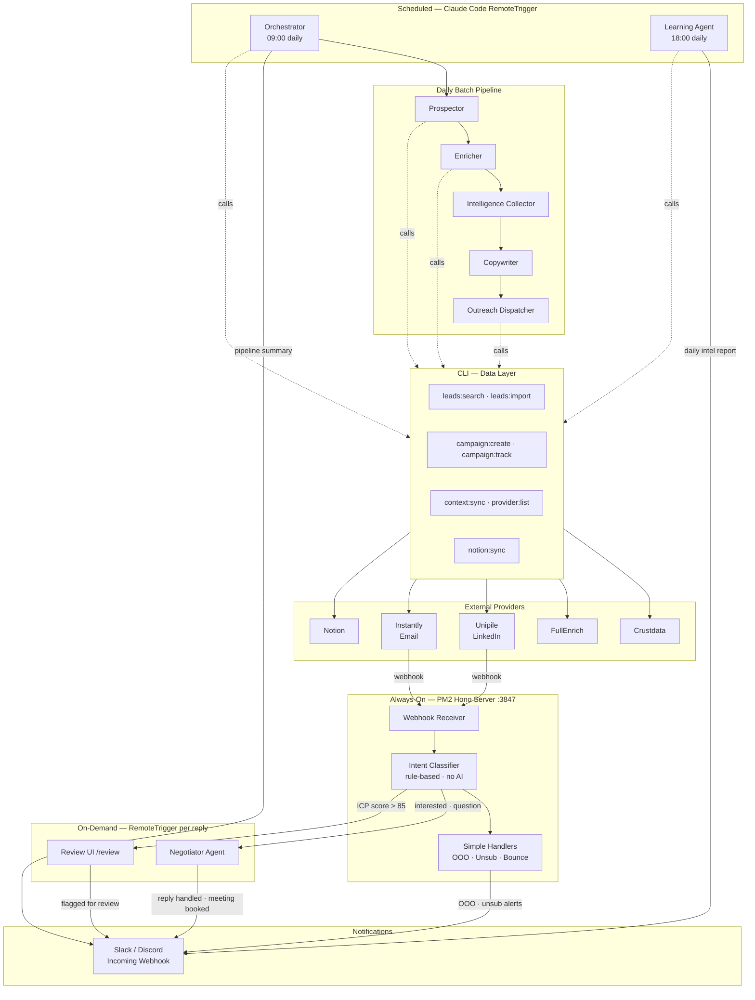
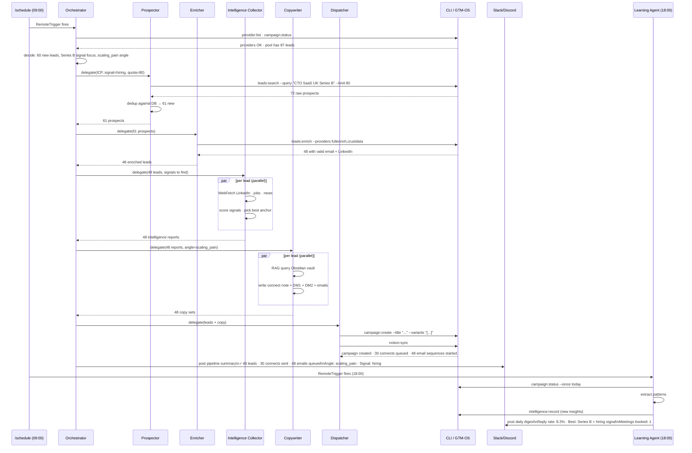
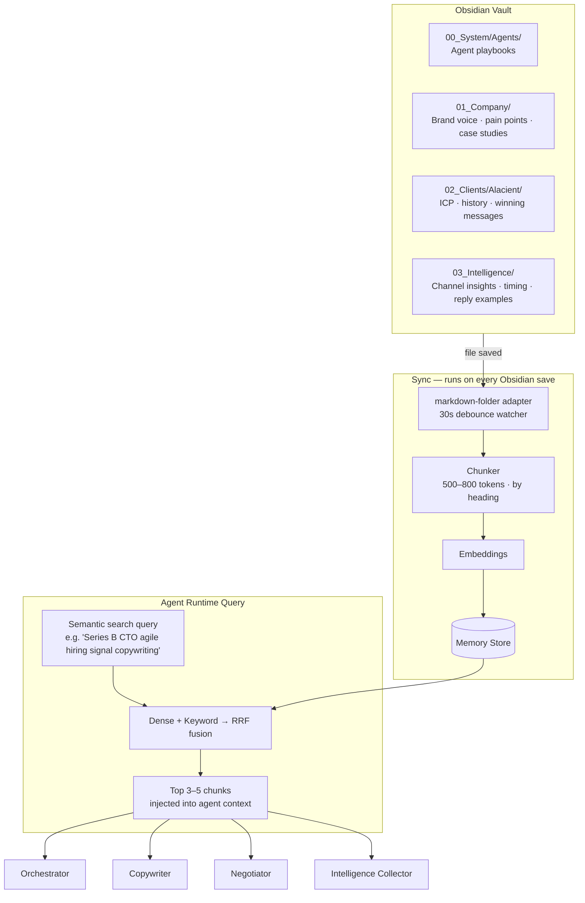
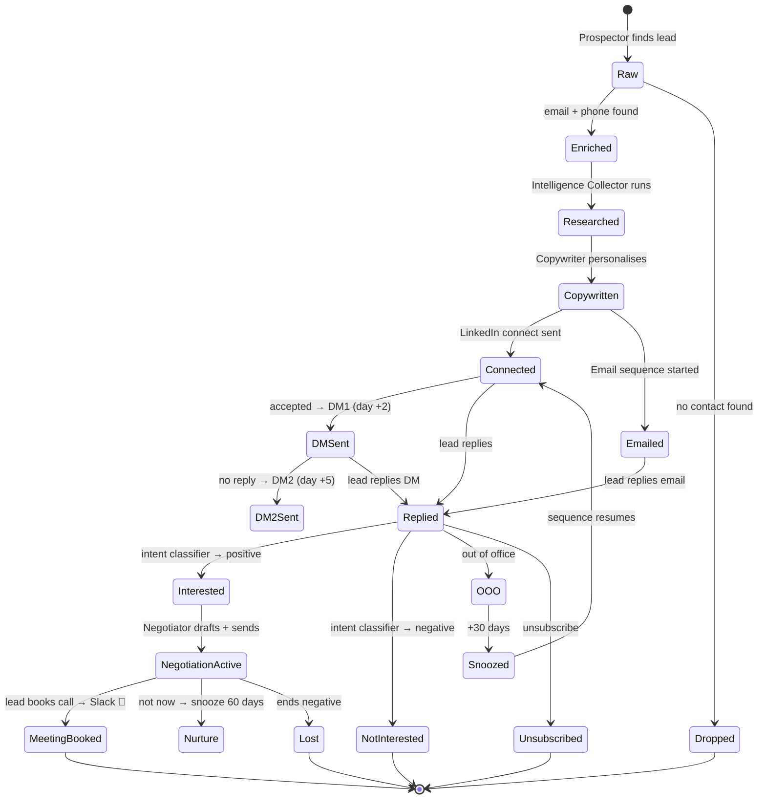

# Alacient Agentic Core System — Architecture & Playbook

> End-to-end documentation for the fully autonomous, multi-agent outbound system built for Alacient. Claude Code is the AI brain. The CLI handles all data operations. Slack/Discord keeps the team informed.

---

## Table of Contents

1. [System Overview](#1-system-overview)
2. [How It Stays Running](#2-how-it-stays-running)
3. [Agent Roster](#3-agent-roster)
4. [Daily Pipeline Architecture](#4-daily-pipeline-architecture)
5. [24/7 Reply & Negotiation Architecture](#5-247-reply--negotiation-architecture)
6. [Slack / Discord Notification Layer](#6-slack--discord-notification-layer)
7. [Context Flow — How Obsidian Feeds Every Agent](#7-context-flow--how-obsidian-feeds-every-agent)
8. [Lead Lifecycle](#8-lead-lifecycle)
9. [Obsidian Vault Structure](#9-obsidian-vault-structure)
10. [Configuration Files](#10-configuration-files)
11. [Setup Checklist](#11-setup-checklist)
12. [Adding a New Client](#12-adding-a-new-client)

---

## 1. System Overview

Three layers. Each has a different operational model:

| Layer | Components | Always on? | AI source |
|---|---|---|---|
| **Daily batch pipeline** | Orchestrator → Prospector → Enricher → Intelligence Collector → Copywriter → Dispatcher | No — fires at 09:00 via `/schedule` | Claude Code (RemoteTrigger) |
| **Persistent server** | Hono server, intent classifier, simple reply handlers | Yes — PM2 daemon | None (rule-based) |
| **On-demand agents** | Negotiator, Learning Agent | No — spawned per event or per schedule | Claude Code (RemoteTrigger) |

**Claude Code is the only AI layer.** No Anthropic API key needed anywhere in the system. The CLI (`npx tsx src/cli/index.ts`) handles all data operations — lead search, enrichment, DB writes, campaign creation, Notion sync. Agents call CLI commands as their tools.



---

## 2. How It Stays Running

### Daily Pipeline — Claude Code `/schedule`

The Orchestrator runs on a cron via Claude Code's RemoteTrigger. No session needs to be open. Set it up once with:

```
/schedule
```

Configure as: `0 9 * * 1-5` (weekdays at 09:00)

Prompt: `"Run the Alacient daily lead gen pipeline: prospect 60 leads matching the ICP in icp-config.yaml, enrich, research each lead's signals, write personalised copy, create campaign and dispatch. Post summary to Slack when done."`

The Learning Agent runs on a separate trigger at 18:00: `0 18 * * 1-5`

### Negotiator — 24/7 via Hono Server

The Hono server runs as a PM2 daemon — always on, no session needed. When a qualifying reply arrives via Unipile or Instantly webhook, the server classifies the intent and fires a RemoteTrigger to spawn the Negotiator agent. The Negotiator handles the reply and exits. Total latency: 15–45 seconds from reply received to response sent.

```
Unipile/Instantly → webhook → Hono server → intent classifier
                                    │
                    ┌───────────────┼──────────────────┐
                    │               │                  │
              simple intent    complex intent    high-value lead
              (handled inline,  (RemoteTrigger   (queued in
               no AI, < 100ms)   → Negotiator)    /review UI)
```

### Review Dashboard

Always accessible at `http://your-server:3847/review`. High-value leads and uncertain replies queue here for human approval before any action is taken.

---

## 3. Agent Roster

### Orchestrator Agent
**Triggered:** Daily at 09:00 via `/schedule` RemoteTrigger
**Role:** Strategy and delegation. Reads state, decides today's targeting, spawns the pipeline, posts completion summary to Slack/Discord.

**What it reads before acting:**
- `~/.gtm-os/tenants/alacient/framework.yaml` — ICP, positioning, segments
- `~/.gtm-os/tenants/alacient/icp-config.yaml` — signal priorities, scoring thresholds
- Intelligence store — validated/proven patterns for today's decisions
- DB state — qualified pool size, active campaign count, reply rates

**CLI commands it calls:**
```bash
npx tsx src/cli/index.ts -t alacient provider:list        # confirm all providers live
npx tsx src/cli/index.ts -t alacient campaign:status      # read pipeline health
```

**Posts to Slack/Discord at end of run:**
- Leads found, enriched, qualified
- Copy angles tested today
- Campaigns created / connects sent
- Any errors or provider failures

---

### Prospector Agent
**Role:** Find companies and people matching today's ICP and signal focus.

**CLI commands it calls:**
```bash
npx tsx src/cli/index.ts -t alacient leads:search \
  --query "CTO SaaS UK 100-500 employees Series B" \
  --signal hiring_scrum_master \
  --limit 80
```

**Output:** Raw prospect list (JSON) passed to Enricher.

---

### Enricher Agent
**Role:** Fill contact gaps — work email, phone, confirm LinkedIn.

**CLI commands it calls:**
```bash
npx tsx src/cli/index.ts -t alacient leads:enrich \
  --input /tmp/raw-prospects.json \
  --providers fullenrich,crustdata
```

---

### Intelligence Collector Agent
**Role:** Per-lead research. Finds the live signal that makes this person a fit right now — LinkedIn post, job posting, funding news, tech stack.

**Tools it uses:** WebFetch (LinkedIn profile, company jobs page, news), Crustdata people API via CLI.

**Output per lead:** Intelligence report with pain signals, best angle, best channel, things to avoid.

---

### Copywriter Agent
**Role:** Write personalised outreach for each lead using their intelligence report + relevant Obsidian vault chunks.

**Queries memory store** for each lead's specific pain signal. Gets back brand voice, pain messaging, case studies, proven copy patterns.

**Produces per lead:** LinkedIn connect note, DM1, DM2, Email1, Email2, Email3 (breakup).

---

### Outreach Dispatcher Agent
**Role:** Create the campaign in GTM-OS and fire first touches.

**CLI commands it calls:**
```bash
npx tsx src/cli/index.ts -t alacient campaign:create \
  --title "UK SaaS CTOs — Agile Pain — Apr W4" \
  --hypothesis "Series B CTOs hiring Scrum Masters respond to bandwidth angle" \
  --variants '[{"name":"A","connectNote":"...","dm1":"...","dm2":"..."}]'

npx tsx src/cli/index.ts -t alacient notion:sync   # CRM update
```

After this, `campaign:track` (cron every 6h via launchd) advances sequences autonomously.

---

### Negotiator Agent
**Triggered:** On-demand per qualifying reply (RemoteTrigger from Hono server)
**Role:** Handle interested/question replies. Draft and send contextual responses.

**Context it receives:**
- Full conversation history
- Lead's original intelligence report
- Reply text + classified intent
- Relevant Obsidian vault chunks (RAG on reply content)
- Negotiation playbook

**Send gates:**
- ICP score < 70 → auto-send immediately
- ICP score 70–85 → send after 3-minute hold
- ICP score > 85 → hold for human approval in `/review`

**Posts to Slack/Discord:**
- Every reply handled (intent + lead name + action taken)
- Every meeting booked 🎉
- Every reply flagged for review (with link to `/review`)

---

### Learning Agent
**Triggered:** Daily at 18:00 via `/schedule` RemoteTrigger
**Role:** Read today's campaign data, extract patterns, update intelligence store and Obsidian vault.

**CLI commands it calls:**
```bash
npx tsx src/cli/index.ts -t alacient campaign:status --since today
npx tsx src/cli/index.ts -t alacient intelligence:record \
  --insight "..." --category channel --confidence validated
```

**Posts to Slack/Discord:** Daily intelligence digest — reply rates, best angle, what to adjust tomorrow.

---

## 4. Daily Pipeline Architecture



---

## 5. 24/7 Reply & Negotiation Architecture

```mermaid
graph LR
    subgraph EXT["External"]
        UNI[Unipile webhook]
        INS[Instantly webhook]
    end

    subgraph SRV["Hono Server — PM2, always on"]
        EP[POST /api/inbound/unipile\nPOST /api/inbound/instantly]
        DB[(Write reply to DB)]
        CLS{Intent Classifier\nrule-based · < 10ms}
        OOO[reschedule +30d]
        UNS[mark DNC]
        BNC[flag email bad]
        NCL[close lead]
    end

    subgraph AGT["On-Demand Agent"]
        RT[RemoteTrigger\nspawns Negotiator]
        NEG[Negotiator Agent\nClaude Code · ~30s]
        REV[/review UI\nhuman queue]
    end

    subgraph SLK["Slack / Discord"]
        N1[reply notification]
        N2[meeting booked 🎉]
        N3[flagged for review]
        N4[OOO / unsub alerts]
    end

    UNI -->|POST| EP
    INS -->|POST| EP
    EP --> DB
    EP --> CLS

    CLS -->|out of office| OOO --> N4
    CLS -->|unsubscribe| UNS --> N4
    CLS -->|bounce| BNC
    CLS -->|not interested| NCL

    CLS -->|interested · question · positive| RT --> NEG
    CLS -->|ICP > 85| REV --> N3

    NEG -->|auto-send < 70| UNI
    NEG -->|auto-send < 70| INS
    NEG -->|3-min hold 70-85| UNI
    NEG --> N1
    NEG -->|meeting booked| N2
```

**Latency targets:**

| Intent | Handler | Time |
|---|---|---|
| OOO / Unsub / Bounce | Server inline | < 100ms |
| Interested / Question | Negotiator Agent | 15–45 sec |
| High-value (ICP > 85) | Human review queue | Your SLA |

---

## 6. Slack / Discord Notification Layer

Both Slack and Discord use identical incoming webhook mechanism — a POST to a URL with a JSON payload. The Slack service (`src/lib/services/slack.ts`) is already built and handles all events.

### Events That Trigger Notifications

| Event | Channel | Who sends it |
|---|---|---|
| Daily pipeline complete | `#alacient-pipeline` | Orchestrator |
| New qualifying reply received | `#alacient-replies` | Negotiator / Server |
| Meeting booked | `#alacient-wins` | Negotiator |
| Reply flagged for human review | `#alacient-review` | Hono server |
| OOO / Unsubscribe | `#alacient-pipeline` | Hono server |
| Daily intel digest | `#alacient-pipeline` | Learning Agent |
| Provider error / pipeline failure | `#alacient-alerts` | Any agent |

### Setting Up Slack

1. Go to `api.slack.com/apps` → Create App → Incoming Webhooks → Activate
2. Add to Workspace → choose channel → copy webhook URL
3. Add to `~/.gtm-os/.env`:
   ```
   SLACK_WEBHOOK_URL=https://hooks.slack.com/services/...
   ```
4. Add to `~/.gtm-os/tenants/alacient/config.yaml`:
   ```yaml
   slack:
     webhook_url: "${SLACK_WEBHOOK_URL}"
     notify_on:
       - reply
       - demo_booked
       - campaign_completed
       - winner_declared
   ```

### Setting Up Discord (alternative)

1. In Discord: channel settings → Integrations → Webhooks → New Webhook → copy URL
2. Add to `~/.gtm-os/.env`:
   ```
   DISCORD_WEBHOOK_URL=https://discord.com/api/webhooks/...
   ```
3. Discord webhooks use `content` (plain text) or `embeds` instead of Slack `blocks`. The notification payload needs a small adapter — see `src/lib/services/slack.ts` for the pattern to follow.

### Notification Format

**Pipeline summary (Orchestrator → Slack):**
```
✅ Alacient Daily Pipeline — Mon 28 Apr 09:47
━━━━━━━━━━━━━━━━━━━━━━━━━━━━━━
Prospects found:    61
Enriched:           48  (79%)
Copy generated:     48
Connects sent:      30  (LinkedIn daily limit)
Emails queued:      48

Angle today:  scaling_pain
Signal focus: Series B + hiring Scrum Masters
[View campaigns →]
```

**Reply received (Negotiator → Slack):**
```
💬 New Reply — Jane Smith, CTO @ DataFlow
Intent: Interested
Message: "This is relevant — how does the engagement work?"
Action: Response sent (auto, ICP 74)
[View conversation →]
```

**Meeting booked:**
```
🎉 Meeting Booked — Jane Smith, CTO @ DataFlow
Campaign: UK SaaS CTOs — Agile Pain — Apr W4
[View in dashboard →]
```

---

## 7. Context Flow — How Obsidian Feeds Every Agent



**What each agent queries:**

| Agent | Query | Gets back |
|---|---|---|
| Orchestrator | `"campaign strategy {segment} intel"` | Campaign history, intel insights, ICP priorities |
| Intelligence Collector | `"{pain signal} buying signal identification"` | How to score that signal |
| Copywriter | `"{pain} {stage} {channel} copywriting"` | Brand voice, pain messaging, case study, tone |
| Negotiator | `"{reply intent} objection handling"` | Specific objection playbook, example threads |
| Learning Agent | `"intelligence patterns {segment} outcomes"` | What to update in intel store |

---

## 8. Lead Lifecycle



---

## 9. Obsidian Vault Structure

```
ObsidianVault/
│
├── 00_System/
│   └── Agents/
│       ├── Orchestrator.md          Daily strategy logic
│       ├── Prospector.md            Search patterns, signal keywords
│       ├── Intelligence_Collector.md  Signal identification, scoring
│       ├── Copywriter.md            Voice rules, copy structure
│       └── Negotiator.md            Objection handling, negotiation flows
│
├── 01_Company/
│   ├── Brand_Voice.md
│   ├── Value_Propositions.md
│   ├── Pain_Points/
│   │   └── [Pain_Type].md
│   ├── Case_Studies/
│   │   └── [Client_Name].md
│   └── Objection_Handling.md
│
├── 02_Clients/
│   └── Alacient/
│       ├── ICP.md
│       ├── Framework.md
│       ├── Winning_Messages.md      ← populated by Learning Agent
│       ├── Campaign_History.md      ← populated by Learning Agent
│       └── Personas/
│           └── [Role].md
│
└── 03_Intelligence/
    ├── Channel_Insights.md          ← updated daily by Learning Agent
    ├── Timing_Insights.md
    └── Reply_Patterns/
        ├── Positive_Examples.md
        └── Negotiation_Flows.md
```

**Frontmatter on every note:**
```yaml
---
agent: copywriter
segment: engineering-leader-scaling
topic: agile-transformation
channel: linkedin
confidence: high
---
```

---

## 10. Configuration Files

| File | Path | What it controls |
|---|---|---|
| `icp-config.yaml` | `~/.gtm-os/tenants/alacient/` | ICP, signals, scoring, sequence timing, copy rules |
| `framework.yaml` | `~/.gtm-os/tenants/alacient/` | GTM framework — positioning, segments, voice |
| `qualification-rules.md` | `~/.gtm-os/tenants/alacient/` | 7-gate pipeline signal rules |
| `adapters.yaml` | `~/.gtm-os/tenants/alacient/` | Obsidian vault sync config |
| `config.yaml` | `~/.gtm-os/tenants/alacient/` | Provider settings, Notion IDs, Slack webhook |
| `.env` | `~/.gtm-os/` | API keys — never committed to git |

---

## 11. Setup Checklist

```
ENVIRONMENT (once)
[ ] Create accounts: Crustdata, Unipile, FullEnrich, Instantly, Notion (optional)
[ ] Create Slack workspace + incoming webhook (or Discord webhook)
[ ] Add all keys to ~/.gtm-os/.env
[ ] npm install -g pm2

ALACIENT TENANT (once)
[ ] npx tsx src/cli/index.ts -t alacient start
[ ] Copy templates → ~/.gtm-os/tenants/alacient/
[ ] Set base_dir in adapters.yaml → your Obsidian vault path
[ ] Fill in Brand_Voice.md, Value_Propositions.md, Objection_Handling.md
[ ] Add SLACK_WEBHOOK_URL to config.yaml
[ ] npx tsx src/cli/index.ts -t alacient context:sync
[ ] npx tsx src/cli/index.ts -t alacient doctor

ALWAYS-ON SERVER
[ ] pm2 start "npx tsx src/lib/server/index.ts" --name alacient-core
[ ] pm2 save && pm2 startup
[ ] Register Unipile webhook → POST http://your-server:3847/api/inbound/unipile
[ ] Register Instantly webhook → POST http://your-server:3847/api/inbound/instantly

SCHEDULED AGENTS (Claude Code /schedule)
[ ] /schedule → Orchestrator → cron: 0 9 * * 1-5 (weekdays 09:00)
[ ] /schedule → Learning Agent → cron: 0 18 * * 1-5 (weekdays 18:00)

FIRST RUN
[ ] Verify: npx tsx src/cli/index.ts -t alacient provider:list
[ ] In Claude Code: "Run the Alacient daily pipeline with 20 leads to test. Review before dispatching."
[ ] Check Slack for pipeline summary notification
[ ] Scale to 60 leads/day after first batch reviewed
```

---

## 12. Adding a New Client

1. Create tenant: `npx tsx src/cli/index.ts -t new-slug start`
2. Copy templates to `~/.gtm-os/tenants/new-slug/`
3. Fill in ICP, signals, brand voice for the new client
4. Create `ObsidianVault/02_Clients/NewClient/` from vault starter
5. Set `base_dir` in `adapters.yaml` (can point to a subfolder)
6. Sync: `npx tsx src/cli/index.ts -t new-slug context:sync`
7. Add `/schedule` triggers for the new tenant
8. Tell Claude Code: "Run the first pipeline for new-slug — ICP is [describe]."

---

*Alacient Agentic Core System — Architecture v1.1 — April 2026*
