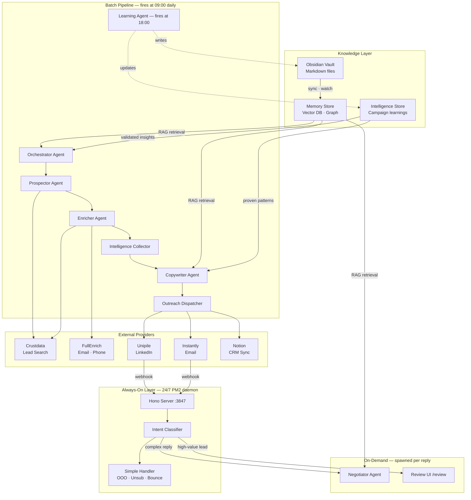
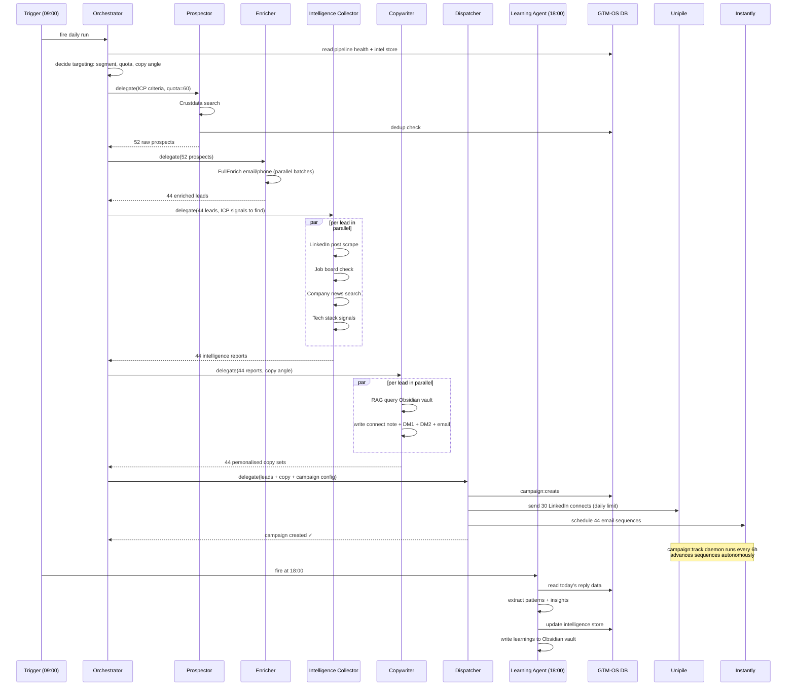
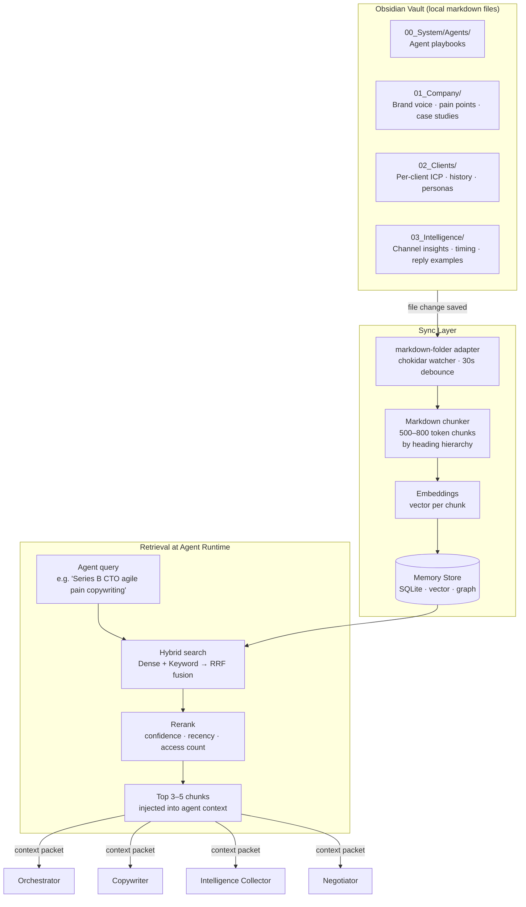
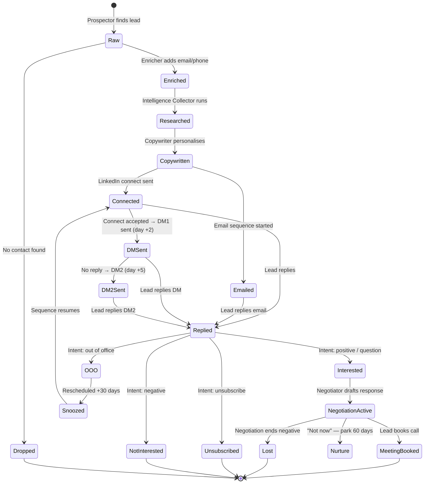

# Agentic GTM System — Architecture & Playbook

> End-to-end documentation for running a fully autonomous, multi-agent outbound GTM system inside Claude Code. No Anthropic API key required for the batch pipeline — Claude Code is the AI layer.

---

## Table of Contents

1. [System Overview](#1-system-overview)
2. [Agent Roster](#2-agent-roster)
3. [Daily Pipeline Architecture](#3-daily-pipeline-architecture)
4. [24/7 Reply & Negotiation Architecture](#4-247-reply--negotiation-architecture)
5. [Context Flow — How Obsidian Feeds Every Agent](#5-context-flow--how-obsidian-feeds-every-agent)
6. [Lead Lifecycle](#6-lead-lifecycle)
7. [Obsidian Vault Structure](#7-obsidian-vault-structure)
8. [Configuration Files](#8-configuration-files)
9. [Setup Checklist](#9-setup-checklist)
10. [Adding a New Client](#10-adding-a-new-client)

---

## 1. System Overview

The system has three layers:

| Layer | What runs here | Always on? |
|---|---|---|
| **Batch pipeline** | Prospecting, enrichment, research, copy generation, campaign creation | No — fires daily at 09:00 |
| **Persistent server** | Webhook receiver, intent classifier, reply routing | Yes — PM2 daemon |
| **On-demand agents** | Negotiation, qualification, learning | No — spawned per event |

Claude Code is the AI brain for the batch pipeline. The Hono server (`src/lib/server/`) is the always-on event router. Specialized agents are spawned on demand when replies arrive.



---

## 2. Agent Roster

### Orchestrator Agent
**Role:** Daily strategy and delegation. Reads current state, decides today's targeting focus, spawns the pipeline.

**Reads before acting:**
- `~/.gtm-os/tenants/{slug}/framework.yaml` — ICP, positioning, segments
- Intelligence store — what patterns are validated vs proven
- DB — pipeline health (qualified lead pool, active campaigns, reply rate)
- Yesterday's campaign results

**Decisions it makes:**
- How many leads to prospect today
- Which segment and signal type to prioritise
- Whether to pause underperforming campaigns
- What copy angle/hypothesis to test

**Context it passes downstream:** A `RunContext` with today's ICP focus, copy angle, segment filter, lead quota, and channel priority.

---

### Prospector Agent
**Role:** Find leads matching today's ICP targeting criteria. Dedup and initial filter only — no scoring.

**Tools used:** Crustdata company + people search, DB dedup check

**Input:** ICP segment definition, signal keywords, company size/industry filters, exclusion list

**Output:** Ranked list of raw prospects with company data, LinkedIn URL, title

---

### Enricher Agent
**Role:** Fill contact gaps. Find work email, direct phone, confirm LinkedIn profile.

**Tools used:** FullEnrich (email/phone), Crustdata People API (LinkedIn confirmation)

**Runs in parallel batches of 10.** Drops leads with no reachable contact (typically 15–20%).

---

### Intelligence Collector Agent
**Role:** Per-lead research. Find the specific signals that make this person a fit right now — not generic ICP match, but live evidence of pain or buying intent.

**Runs in parallel per lead via WebFetch + Crustdata.**

**What it looks for per lead:**
- Recent LinkedIn posts mentioning relevant pain signals
- Active job postings indicating team/process scaling needs
- Company news (funding, acquisitions, digital transformation announcements)
- Tech stack signals (tools they use that indicate maturity level)
- Team size and growth trajectory

**Output per lead:** Intelligence report with pain signals, ICP score, best angle, channel recommendation, things to avoid.

---

### Copywriter Agent
**Role:** Write personalised outreach for each lead using their intelligence report + relevant chunks from the Obsidian vault.

**Queries the memory store** with the lead's specific pain signal as the search input. Gets back the most relevant brand voice, messaging, case studies, and proven copy patterns.

**Produces per lead:**
- LinkedIn connect note (< 300 chars)
- LinkedIn DM 1 (sent after connect accepted, day +2)
- LinkedIn DM 2 (day +5, if no reply)
- Email subject + body (parallel channel)

All copy passes `validateMessage()` before dispatch. No exceptions.

---

### Outreach Dispatcher Agent
**Role:** Create the campaign in GTM-OS and fire first touches.

**Actions:**
1. `yalc-gtm campaign:create` with explicit title, hypothesis, variant copy, lead filter
2. LinkedIn connect requests via Unipile (max 30/day, enforced by rate limiter)
3. Email sequences scheduled in Instantly
4. Notion CRM sync

After this, `campaign:track` (launchd daemon, runs every 6h) handles all sequence advancement autonomously.

---

### Negotiator Agent
**Role:** Handle inbound replies that indicate interest, questions, or negotiation. Draft and send contextual responses. Spawned on demand — not always running.

**Context it receives:**
- Full conversation history
- Lead's original intelligence report
- Their reply text + classified intent
- Relevant Obsidian chunks (RAG query on the reply content)
- Negotiation playbook

**Send gates:**
- ICP score < 70 → auto-send immediately
- ICP score 70–85 → send after 3-minute hold (veto window)
- ICP score > 85 → hold for human approval in `/review` UI

---

### Learning Agent
**Role:** End-of-day intelligence update. Reads today's campaign outcomes and writes learnings back to both the intelligence store and the Obsidian vault.

**Fires at 18:00 daily.**

**What it captures:**
- Reply rates by copy angle, segment, and channel
- Which pain signals correlated with positive replies
- Which objections appeared and how they resolved
- Timing patterns (day of week, hour)

---

## 3. Daily Pipeline Architecture



---

## 4. 24/7 Reply & Negotiation Architecture

The batch pipeline fires and exits. Replies can arrive at any time. The Hono server is what stays alive — not an agent.

```mermaid
graph LR
    subgraph EXTERNAL["External Platforms"]
        UNI[Unipile\nLinkedIn webhook]
        INS[Instantly\nEmail webhook]
    end

    subgraph SERVER["Hono Server — always running PM2"]
        WH[POST /api/inbound/unipile\nPOST /api/inbound/instantly]
        CLS{Intent\nClassifier}
        DB[(GTM-OS DB\nwrite reply)]

        OOO[reschedule +30d]
        UNS[mark do-not-contact]
        BNC[flag email invalid]
        NCL[close lead]
    end

    subgraph AGENT["On-Demand — spawned per reply"]
        NEG[Negotiator Agent\n~30s to draft + send]
        REV[/review UI\nhuman approval queue]
    end

    UNI -->|POST| WH
    INS -->|POST| WH
    WH --> DB
    WH --> CLS

    CLS -->|out of office| OOO
    CLS -->|unsubscribe| UNS
    CLS -->|bounce| BNC
    CLS -->|not interested| NCL

    CLS -->|interested / question / positive| NEG
    CLS -->|ICP score > 85| REV

    NEG -->|ICP < 70: auto-send| UNI
    NEG -->|ICP < 70: auto-send| INS
    NEG -->|ICP 70-85: 3min hold| UNI
    REV -->|human approved| NEG
```

**Latency targets:**

| Intent | Handler | Response time |
|---|---|---|
| Out of office | Server inline | < 100ms |
| Unsubscribe | Server inline | < 100ms |
| Bounce | Server inline | < 100ms |
| Interested / Question | Negotiator Agent | 15–45 seconds |
| High-value (ICP > 85) | Human review queue | Your SLA |

---

## 5. Context Flow — How Obsidian Feeds Every Agent

The `markdown-folder` adapter syncs the Obsidian vault into the vector memory store. Every agent queries it at runtime with a specific search — not a dump of everything, just the top 3–5 chunks most relevant to the current task.



**What each agent queries:**

| Agent | Query | Chunks it gets back |
|---|---|---|
| Orchestrator | `"campaign strategy {segment} current intelligence"` | Campaign history, intel insights, ICP priorities |
| Intelligence Collector | `"{lead pain signal} buying signal identification"` | How to score that signal, what weight it carries |
| Copywriter | `"{pain} {company stage} {channel} copywriting"` | Brand voice, pain messaging, case study, tone rules |
| Negotiator | `"{reply intent} objection handling response"` | Specific objection playbook, negotiation tone, example |
| Learning Agent | `"intelligence patterns {segment} outcomes"` | What to look for when updating the intel store |

---

## 6. Lead Lifecycle



---

## 7. Obsidian Vault Structure

Create this folder structure in your Obsidian vault. The `markdown-folder` adapter will sync it into the memory store automatically.

```
ObsidianVault/
│
├── 00_System/
│   └── Agents/
│       ├── Orchestrator.md          Daily strategy logic, when to scale/pause
│       ├── Prospector.md            Search patterns, signal keywords, filters
│       ├── Intelligence_Collector.md  Signal identification, scoring weights
│       ├── Copywriter.md            Voice rules, copy structure, what to avoid
│       └── Negotiator.md            Objection handling, negotiation flows
│
├── 01_Company/
│   ├── Brand_Voice.md               Tone, style, language rules
│   ├── Value_Propositions.md        Core claims per segment
│   ├── Pain_Points/
│   │   ├── [Pain_Type_1].md         How to talk about each pain
│   │   └── [Pain_Type_2].md
│   ├── Case_Studies/
│   │   └── [Client_Name].md         What worked, numbers, their situation
│   └── Objection_Handling.md        Objection → response library
│
├── 02_Clients/
│   └── {ClientName}/
│       ├── ICP.md                   Who we target, signals, exclusions
│       ├── Framework.md             GTM framework summary
│       ├── Winning_Messages.md      Messages that got replies (real examples)
│       ├── Campaign_History.md      What we've run, results, lessons
│       └── Personas/
│           └── {Role_Name}.md       Persona-specific notes
│
└── 03_Intelligence/
    ├── Channel_Insights.md          What works per channel (updated daily)
    ├── Timing_Insights.md           Day/hour patterns
    ├── Reply_Patterns/
    │   ├── Positive_Examples.md     Real replies + what triggered them
    │   └── Negotiation_Flows.md     Full threads that closed
    └── What_Not_To_Do.md            Anti-patterns and failures
```

**Frontmatter convention** (add to every note for better retrieval):

```yaml
---
agent: copywriter          # which agent uses this most
segment: series-b-cto      # relevant ICP segment
topic: agile-transformation # content topic
channel: linkedin          # if channel-specific
confidence: high           # how reliable this knowledge is
---
```

**Obsidian-specific notes:**
- Wikilinks `[[Page Name]]` index as text — they won't pull in linked content. Use headings within one file instead of cross-linking for content you want retrieved together.
- The chunker splits on `##` boundaries. Good heading structure = precise retrieval.
- Every save triggers re-sync within 30 seconds. Edit tonight → agents pick it up tomorrow morning.

---

## 8. Configuration Files

### `~/.gtm-os/tenants/{slug}/framework.yaml`
The master GTM framework. Controls ICP targeting, positioning, voice, and signals across the entire pipeline. See `templates/framework.yaml` for the full schema.

### `~/.gtm-os/tenants/{slug}/qualification-rules.md`
Signal matching rules for the 7-gate qualification pipeline. Controls which signals pass or fail each gate. See `templates/qualification-rules.md`.

### `~/.gtm-os/tenants/{slug}/adapters.yaml`
Obsidian vault sync configuration. Points the `markdown-folder` adapter at your vault and specifies which paths to index. See `templates/adapters.yaml`.

### `~/.gtm-os/tenants/{slug}/icp-config.yaml`
Human-readable ICP and signal definitions. This is the file you update when targeting criteria change — the pipeline reads it at runtime. See `templates/icp-config.yaml`.

### `~/.gtm-os/.env`
API keys. Never committed to git. See setup checklist below.

---

## 9. Setup Checklist

```
INITIAL SETUP (once per environment)
[ ] Install: npm install -g yalc-gtm-os
[ ] Set API keys in ~/.gtm-os/.env:
    UNIPILE_API_KEY=...
    UNIPILE_DSN=...
    CRUSTDATA_API_KEY=...
    FULLENRICH_API_KEY=...
    INSTANTLY_API_KEY=...
    NOTION_API_KEY=...        (optional)
    GTM_OS_API_TOKEN=...      (generate: openssl rand -hex 32)
[ ] Start the persistent server: pm2 start "npx tsx src/lib/server/index.ts" --name gtm-os
[ ] Verify: yalc-gtm doctor

PER CLIENT (once per client tenant)
[ ] Create tenant: yalc-gtm -t {slug} start
[ ] Copy templates/framework.yaml → ~/.gtm-os/tenants/{slug}/framework.yaml
[ ] Fill in ICP, signals, voice for this client
[ ] Copy templates/icp-config.yaml → ~/.gtm-os/tenants/{slug}/icp-config.yaml
[ ] Copy templates/qualification-rules.md → ~/.gtm-os/tenants/{slug}/qualification-rules.md
[ ] Copy templates/adapters.yaml → ~/.gtm-os/tenants/{slug}/adapters.yaml
[ ] Set base_dir in adapters.yaml to point at client's Obsidian vault folder
[ ] Sync vault: yalc-gtm -t {slug} context:sync
[ ] Configure Notion DBs (if using): add IDs to ~/.gtm-os/tenants/{slug}/config.yaml
[ ] Register webhooks in Unipile dashboard → POST /api/inbound/unipile
[ ] Register webhooks in Instantly dashboard → POST /api/inbound/instantly
[ ] Test providers: yalc-gtm -t {slug} provider:list
[ ] Run first pipeline manually: tell Claude Code "run the daily pipeline for {slug}"

ONGOING (automatic after setup)
[ ] launchd or cron fires Orchestrator at 09:00 daily
[ ] PM2 server handles all inbound replies 24/7
[ ] Negotiator spawned per qualifying reply
[ ] Learning Agent fires at 18:00, updates Obsidian + intel store
[ ] Review high-value leads at /review when flagged
```

---

## 10. Adding a New Client

1. **Create the tenant:**
   ```bash
   ! yalc-gtm -t new-client-slug start
   ```

2. **Copy and fill the templates:**
   ```
   templates/framework.yaml          → ~/.gtm-os/tenants/new-client-slug/framework.yaml
   templates/icp-config.yaml         → ~/.gtm-os/tenants/new-client-slug/icp-config.yaml
   templates/qualification-rules.md  → ~/.gtm-os/tenants/new-client-slug/qualification-rules.md
   templates/adapters.yaml           → ~/.gtm-os/tenants/new-client-slug/adapters.yaml
   ```

3. **Create the Obsidian vault folder** (or subfolder within an existing vault):
   ```
   ObsidianVault/02_Clients/NewClient/
   ```
   Copy the starter notes from `templates/obsidian-vault/02_Clients/Template_Client/`.

4. **Sync and verify:**
   ```bash
   ! yalc-gtm -t new-client-slug context:sync
   ! yalc-gtm -t new-client-slug doctor
   ```

5. **Tell me to run the first pipeline:**
   > "Run the first lead gen pipeline for new-client-slug. ICP is [describe]. Target 40 leads to start."

---

*Architecture version: 1.0 — April 2026*
