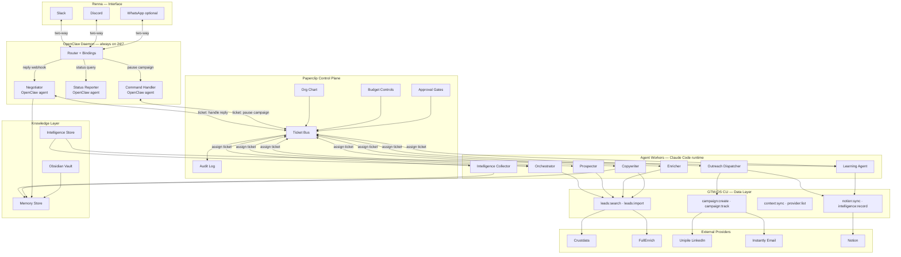
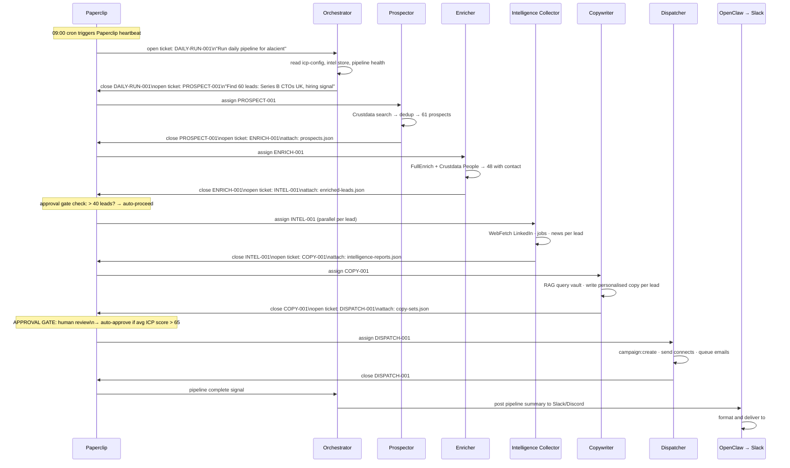

# Alacient Agentic Core — OpenClaw + Paperclip Integration Plan

> How to transform the Alacient Agentic Core System from a Claude Code-scheduled pipeline into a fully autonomous, self-coordinating multi-agent company — using Paperclip as the control plane and OpenClaw as the always-on communication layer.

---

## Table of Contents

1. [Why This Integration](#1-why-this-integration)
2. [What Each System Does](#2-what-each-system-does)
3. [Target Architecture](#3-target-architecture)
4. [Agent-to-Agent Communication Model](#4-agent-to-agent-communication-model)
5. [OpenClaw Communication Layer](#5-openclaw-communication-layer)
6. [Implementation Phases](#6-implementation-phases)
7. [Paperclip Org Chart for Alacient](#7-paperclip-org-chart-for-alacient)
8. [Agent Ticket Schemas](#8-agent-ticket-schemas)
9. [OpenClaw Routing Configuration](#9-openclaw-routing-configuration)
10. [What Changes vs Current Architecture](#10-what-changes-vs-current-architecture)
11. [Tech Stack After Integration](#11-tech-stack-after-integration)

---

## 1. Why This Integration

The current architecture has three limitations:

**1. Claude Code dependency.** The daily pipeline requires `/schedule` RemoteTriggers that are tied to Claude Code sessions. If the session expires or Claude Code is unavailable, the pipeline stops.

**2. One-way notifications.** The Slack/Discord integration is outbound-only — agents post updates but Renna cannot interact back (approve a reply, pause a campaign, ask about status) through Slack.

**3. No true agent-to-agent communication.** Agents currently hand off through the Orchestrator as an intermediary. There's no direct agent-to-agent messaging, shared state, or audit trail of inter-agent communication.

**After integration:**
- Paperclip manages the org chart and routes tickets between agents autonomously — no Claude Code session needed
- OpenClaw makes the Slack/Discord interface two-way — Renna can command the system from Slack
- Every agent handoff is a structured ticket with full audit log
- The system runs as a genuine multi-agent company, not a scheduled script

---

## 2. What Each System Does

### Paperclip (`paperclip.ing` · `github.com/paperclipai/paperclip`)

Paperclip is an open-source orchestration control plane — described as "the operating system for zero-human companies." It coordinates multiple AI agents like a company org chart.

**Key concepts:**
- **Org chart** — define which agent manages which, who reports to whom
- **Tickets** — all agent-to-agent communication happens through structured tickets with full audit logs. An agent completes work, closes its ticket, opens the next one.
- **Heartbeats** — agents run in short bursts, not continuously. Paperclip triggers them when there's work to do.
- **Budget controls** — set credit/cost limits per agent and per run
- **Approval gates** — configurable checkpoints where a human must approve before the next step proceeds
- **Config versioning** — every change to agent behaviour is versioned and rollbackable

**What it replaces:**
- The `/schedule` RemoteTrigger for orchestrating the daily pipeline
- Manual handoffs between agents (Orchestrator→Prospector→Enricher etc.)
- The ad-hoc human review queue (now formalized as approval gates)

### OpenClaw (`openclaw.ai` · `github.com/openclaw/openclaw`)

OpenClaw is a persistent AI assistant daemon that connects to 12+ messaging platforms simultaneously (Slack, Discord, WhatsApp, Telegram, iMessage, and more) and routes messages between platforms and agents.

**Key concepts:**
- **Always-on daemon** — runs as a server process, never exits. Replaces PM2 for the communication layer.
- **Multi-agent routing** — multiple isolated agents run within one OpenClaw process, each with their own workspace, state, and tools
- **Bindings** — deterministic rules that map incoming messages on a channel to a specific agent. "Message in #alacient-replies → Negotiator agent"
- **Two-way** — Renna can send commands from Slack, OpenClaw routes them to the right agent and returns the response
- **ReAct loop** — each OpenClaw agent runs a Reason → Act → Observe loop

**What it replaces:**
- The PM2 Hono server for 24/7 message handling
- One-way Slack incoming webhooks
- The manual intent classifier (OpenClaw's routing bindings replace it)

---

## 3. Target Architecture



---

## 4. Agent-to-Agent Communication Model

All agent communication flows through Paperclip's ticket bus. No agent calls another agent directly. This gives every handoff an audit trail, retry logic, and the ability to pause/inspect at any point.



**Key properties of this model:**

- **Async by default** — Paperclip assigns tickets and agents pick them up on their next heartbeat. No blocking calls.
- **Parallel where possible** — Intelligence Collector runs per-lead in parallel tickets. Paperclip manages concurrency.
- **Full audit trail** — every ticket open/close/assign is logged with timestamp, agent, and payload diff
- **Resumable** — if the Enricher fails midway, Paperclip retries from the last successful ticket, not from the beginning
- **Inspectable** — Paperclip's React UI shows every ticket in every state at any time

---

## 5. OpenClaw Communication Layer

OpenClaw replaces the PM2 Hono server as the always-on communication gateway. It runs as a persistent daemon with three bound agents:

### Agent Bindings

```yaml
# openclaw.config.yaml

agents:
  - id: negotiator
    description: "Handles inbound LinkedIn and email replies"
    bindings:
      - channel: slack
        room: "#alacient-replies-raw"     # Unipile/Instantly post here via webhook
        trigger: message_received
      - channel: discord
        room: "alacient-replies-raw"
    capabilities:
      - read conversation history from GTM-OS DB
      - query Obsidian vault via memory store
      - draft and send replies via Unipile/Instantly CLI
      - open Paperclip ticket for approval when ICP > 85

  - id: status-reporter
    description: "Answers status questions from Renna"
    bindings:
      - channel: slack
        room: "#alacient-status"
        trigger: message_received
        filter: "mentions @alacient-core"
      - channel: discord
        room: "alacient-status"
        trigger: message_received
    capabilities:
      - read campaign:status from CLI
      - read pipeline health from DB
      - read current ticket state from Paperclip
      - post formatted response back to channel

  - id: command-handler
    description: "Executes commands from Renna (pause, resume, approve)"
    bindings:
      - channel: slack
        room: "#alacient-commands"
        trigger: message_received
      - channel: discord
        room: "alacient-commands"
        trigger: message_received
    capabilities:
      - "pause campaign" → campaign:pause --id {id}
      - "approve reply" → release held Negotiator response
      - "run pipeline now" → open Paperclip ticket for Orchestrator
      - "show leads today" → leads:list --since today
      - "snooze {name}" → mark lead as Snoozed
```

### Two-Way Slack/Discord via OpenClaw

**Renna can now do this from Slack:**

```
Renna: @alacient-core status
Bot:   📊 Alacient Pipeline — Mon 28 Apr
       Connects sent today: 30
       Email sequences active: 48
       Replies received: 3 (2 interested, 1 OOO)
       Meetings booked this week: 1
       Next run: Tue 09:00

Renna: @alacient-core pause campaign UK-CTOs-Apr-W4
Bot:   ✅ Campaign "UK SaaS CTOs — Apr W4" paused.
       30 leads mid-sequence. Resume with: resume campaign UK-CTOs-Apr-W4

Renna: approve reply Jane Smith
Bot:   ✅ Reply sent to Jane Smith (CTO @ DataFlow)
       "Happy to walk you through it — easier to show than explain.
        20 min this week?" + calendar link
```

### OpenClaw Replaces the Hono Server For

| Old (Hono + PM2) | New (OpenClaw) |
|---|---|
| `POST /api/inbound/unipile` | OpenClaw binding on `#alacient-replies-raw` |
| Manual intent classifier | OpenClaw routing bindings + Negotiator agent |
| One-way Slack webhook | Two-way OpenClaw ↔ Slack |
| PM2 process management | OpenClaw daemon (self-managing) |
| `/review` UI for approvals | Slack/Discord approval thread via OpenClaw |

---

## 6. Implementation Phases

### Phase 1 — Deploy Paperclip (1–2 days)

**Goal:** Get Paperclip running and define the Alacient org chart.

```bash
# Clone and run Paperclip
git clone https://github.com/paperclipai/paperclip
cd paperclip
npm install
npm run dev
```

Paperclip opens a web UI (default: `localhost:4000`). You'll use this to:

1. **Define the org chart** — create each agent as a "role" with:
   - Name and description
   - Capabilities (what tickets it can handle)
   - Tools (which CLI commands it can call)
   - Budget limit (max provider credits per run)

2. **Configure the ticket schemas** — define what data travels in each ticket (see Section 8)

3. **Set the daily cron** — in Paperclip's scheduler, set `DAILY-PIPELINE` to fire at `0 9 * * 1-5` and `LEARNING-CYCLE` at `0 18 * * 1-5`

4. **Set approval gates:**
   - After Copywriter: auto-approve if avg ICP score ≥ 65
   - After Dispatcher: always notify Slack
   - Before Negotiator sends: auto-approve if ICP < 70, hold if ICP ≥ 70

**Deliverable:** Paperclip UI shows Alacient org chart with 8 roles and ticket flow configured.

---

### Phase 2 — Register Agents as Paperclip Workers (2–3 days)

Each agent becomes a Paperclip worker — an HTTP endpoint that Paperclip calls with a ticket and expects a result back.

Each worker is a small Node.js/TypeScript service:

```typescript
// src/agents/prospector-worker.ts
import express from 'express'
import { execSync } from 'child_process'

const app = express()
app.use(express.json())

// Paperclip calls this when a PROSPECT ticket is assigned
app.post('/run', async (req, res) => {
  const ticket = req.body  // { id, type: 'PROSPECT-001', input: { quota, signal, icp } }

  // Use Claude Code for AI reasoning via subprocess (or inline if in CC session)
  // Use CLI for data operations
  const result = execSync(
    `npx tsx src/cli/index.ts -t alacient leads:search \
      --query "${ticket.input.query}" \
      --limit ${ticket.input.quota}`
  )

  // Return result — Paperclip closes ticket and opens next one
  res.json({
    status: 'complete',
    output: JSON.parse(result.toString()),
    next_ticket: 'ENRICH-001',
    next_input: { leads: JSON.parse(result.toString()) }
  })
})

app.listen(3901)
```

Worker port map:
| Agent | Port |
|---|---|
| Orchestrator | 3900 |
| Prospector | 3901 |
| Enricher | 3902 |
| Intelligence Collector | 3903 |
| Copywriter | 3904 |
| Outreach Dispatcher | 3905 |
| Learning Agent | 3906 |

**Deliverable:** All 7 agent workers running, Paperclip can assign tickets to each and receive results.

---

### Phase 3 — Deploy OpenClaw (1 day)

```bash
# Install OpenClaw
npm install -g openclaw
openclaw init alacient-core

# Start the daemon
openclaw start --config openclaw.config.yaml
```

Connect channels:
1. **Slack:** `openclaw connect slack --token xoxb-...`
2. **Discord:** `openclaw connect discord --token ...`
3. Configure bindings in `openclaw.config.yaml` (see Section 9)

**Deliverable:** OpenClaw daemon running, connected to Slack and Discord, routing messages to the right agents.

---

### Phase 4 — Wire Paperclip ↔ OpenClaw (1 day)

Connect the two systems:

1. **Outbound notifications:** Paperclip posts ticket state changes to an OpenClaw webhook endpoint. OpenClaw formats and delivers to Slack/Discord.

2. **Inbound commands:** OpenClaw Command Handler agent opens Paperclip tickets when Renna sends commands from Slack.

3. **Approval gates:** When Paperclip hits a gate, it posts to OpenClaw → OpenClaw posts an approval request to Slack with ✅/❌ buttons → Renna clicks → OpenClaw sends approval back to Paperclip → pipeline continues.

```
Paperclip gate triggered
    → POST openclaw/webhook/approval-needed
    → OpenClaw formats as Slack interactive message
    → Renna clicks ✅
    → Slack sends interaction to OpenClaw
    → OpenClaw POST paperclip/tickets/{id}/approve
    → Pipeline continues
```

**Deliverable:** Full two-way loop working. Renna can approve gates from Slack buttons.

---

### Phase 5 — Replace Hono Server with OpenClaw Negotiator (1 day)

Configure Unipile and Instantly to post reply webhooks to OpenClaw instead of the Hono server:

- Unipile webhook: `POST http://your-server:8080/openclaw/inbound/unipile`
- Instantly webhook: `POST http://your-server:8080/openclaw/inbound/instantly`

The OpenClaw Negotiator binding picks these up, classifies intent, either handles inline or opens a Paperclip ticket for the Negotiator agent worker.

The Hono server can be kept running for the `/review` dashboard UI — it doesn't need to handle webhooks anymore.

**Deliverable:** All inbound replies flow through OpenClaw. Hono server retained for dashboard only.

---

### Phase 6 — End-to-End Test (1 day)

1. Manually trigger a Paperclip run: `POST paperclip/tickets` with `type: DAILY-PIPELINE`
2. Watch ticket flow in Paperclip UI — each agent should pick up its ticket, complete, hand off
3. Watch Slack for pipeline summary notification
4. Send a test reply in Unipile → confirm OpenClaw routes it → Negotiator drafts response → Slack notification
5. Test command from Slack: `@alacient-core status`
6. Test approval gate: trigger a high-ICP lead → confirm Slack approval button appears

---

## 7. Paperclip Org Chart for Alacient

```
ALACIENT AGENTIC CORE
│
├── ORCHESTRATOR (manager)
│   ├── manages: all batch pipeline agents
│   ├── budget: $0 (no direct API calls)
│   ├── triggers: daily at 09:00 (Paperclip cron)
│   └── approval gate: none (auto-proceeds)
│
├── PROSPECTOR (reports to Orchestrator)
│   ├── handles tickets: PROSPECT-*
│   ├── tools: leads:search, leads:list
│   ├── budget: 50 Crustdata credits/run
│   └── approval gate: none
│
├── ENRICHER (reports to Orchestrator)
│   ├── handles tickets: ENRICH-*
│   ├── tools: leads:enrich
│   ├── budget: 100 FullEnrich credits/run
│   └── approval gate: none
│
├── INTELLIGENCE COLLECTOR (reports to Orchestrator)
│   ├── handles tickets: INTEL-* (parallel per lead)
│   ├── tools: WebFetch, leads:enrich (Crustdata people)
│   ├── budget: no credit cost (web scraping)
│   └── approval gate: none
│
├── COPYWRITER (reports to Orchestrator)
│   ├── handles tickets: COPY-*
│   ├── tools: memory store query (Obsidian RAG)
│   ├── budget: $0 (Claude Code is AI layer, no API cost)
│   └── approval gate: REVIEW if avg ICP score < 60
│
├── OUTREACH DISPATCHER (reports to Orchestrator)
│   ├── handles tickets: DISPATCH-*
│   ├── tools: campaign:create, notion:sync
│   ├── budget: 0 (sends via Unipile/Instantly, not credit-based)
│   └── approval gate: REQUIRED on first run, then auto if ICP avg > 65
│
├── NEGOTIATOR (autonomous — reports to OpenClaw)
│   ├── handles tickets: NEGOTIATE-* (opened by OpenClaw on reply)
│   ├── tools: conversation history, memory store, Unipile send, Instantly send
│   ├── budget: $0
│   └── approval gate: auto if ICP < 70 · hold if ICP 70-85 · required if ICP > 85
│
└── LEARNING AGENT (autonomous — reports to Orchestrator)
    ├── handles tickets: LEARN-*
    ├── tools: campaign:status, intelligence:record, context:sync
    ├── budget: $0
    ├── triggers: daily at 18:00 (Paperclip cron)
    └── approval gate: none (read + write only, no sending)
```

---

## 8. Agent Ticket Schemas

```typescript
// All tickets follow this base schema
interface Ticket {
  id: string               // e.g. "PROSPECT-2026-04-28-001"
  type: TicketType
  status: 'open' | 'in_progress' | 'blocked' | 'closed' | 'failed'
  assignedTo: AgentId
  openedBy: AgentId
  openedAt: string         // ISO timestamp
  closedAt?: string
  input: Record<string, unknown>
  output?: Record<string, unknown>
  nextTicket?: Partial<Ticket>
  auditLog: AuditEntry[]
}

// Specific ticket types
type DAILY_PIPELINE = {
  type: 'DAILY_PIPELINE'
  input: { tenantId: string; date: string }
}

type PROSPECT = {
  type: 'PROSPECT'
  input: {
    query: string
    signal_focus: 'hiring' | 'linkedin_activity' | 'company_event' | 'combination'
    quota: number
    icp_filters: { roles: string[]; sizes: string[]; industries: string[] }
  }
  output: { prospects: RawProspect[]; dedup_removed: number }
}

type ENRICH = {
  type: 'ENRICH'
  input: { prospects: RawProspect[] }
  output: { enriched: EnrichedLead[]; no_contact_found: number }
}

type INTEL = {
  type: 'INTEL'
  input: { lead: EnrichedLead; signals_to_find: string[] }
  output: IntelligenceReport
}

type COPY = {
  type: 'COPY'
  input: { reports: IntelligenceReport[]; copy_angle: string }
  output: { copy_sets: CopySet[] }   // one per lead
}

type DISPATCH = {
  type: 'DISPATCH'
  input: { leads: EnrichedLead[]; copy_sets: CopySet[]; campaign_title: string }
  output: { campaign_id: string; connects_sent: number; emails_queued: number }
}

type NEGOTIATE = {
  type: 'NEGOTIATE'
  input: {
    lead_id: string
    reply_text: string
    intent: 'interested' | 'question' | 'positive' | 'pricing' | 'not_now'
    conversation_history: Message[]
    intelligence_report: IntelligenceReport
  }
  output: { draft: string; action: 'auto_sent' | 'held_for_approval' | 'queued_review' }
}

type LEARN = {
  type: 'LEARN'
  input: { date: string; campaign_ids: string[] }
  output: { insights_added: number; vault_files_updated: string[] }
}
```

---

## 9. OpenClaw Routing Configuration

```yaml
# openclaw.config.yaml

server:
  port: 8080
  name: "Alacient Agentic Core"

channels:
  slack:
    token: "${SLACK_BOT_TOKEN}"
    signing_secret: "${SLACK_SIGNING_SECRET}"
  discord:
    token: "${DISCORD_BOT_TOKEN}"

agents:

  - id: negotiator
    description: "Handles inbound LinkedIn and email replies 24/7"
    model: claude-code               # uses Claude Code subprocess for AI reasoning
    system_prompt_file: "templates/obsidian-vault/00_System/Agents/Negotiator.md"
    bindings:
      - event: webhook
        path: /inbound/unipile
        action: run
      - event: webhook
        path: /inbound/instantly
        action: run
    tools:
      - name: read_db
        command: "npx tsx src/cli/index.ts -t alacient leads:list --id {lead_id}"
      - name: query_vault
        command: "npx tsx src/cli/index.ts -t alacient memory:query --q '{query}'"
      - name: send_linkedin
        command: "npx tsx src/cli/index.ts -t alacient campaign:reply --channel linkedin --lead {lead_id} --message '{msg}'"
      - name: send_email
        command: "npx tsx src/cli/index.ts -t alacient campaign:reply --channel email --lead {lead_id} --message '{msg}'"
      - name: open_paperclip_ticket
        http: POST paperclip/tickets
    on_complete:
      - notify_slack: "#alacient-replies"

  - id: status-reporter
    description: "Answers status questions from Renna"
    bindings:
      - channel: slack
        rooms: ["#alacient-status", "#alacient-general"]
        trigger: mention          # responds when @alacient-core is mentioned
      - channel: discord
        rooms: ["alacient-status"]
        trigger: mention
    tools:
      - name: campaign_status
        command: "npx tsx src/cli/index.ts -t alacient campaign:status"
      - name: provider_status
        command: "npx tsx src/cli/index.ts -t alacient provider:list"
      - name: paperclip_status
        http: GET paperclip/tickets?status=in_progress

  - id: command-handler
    description: "Executes commands from Renna"
    bindings:
      - channel: slack
        rooms: ["#alacient-commands", "#alacient-general"]
        trigger: mention
        prefix: "/"               # responds to /pause, /resume, /approve etc.
      - channel: discord
        rooms: ["alacient-commands"]
        trigger: mention
        prefix: "/"
    commands:
      pause_campaign:
        pattern: "/pause campaign {id}"
        action: "npx tsx src/cli/index.ts -t alacient campaign:pause --id {id}"
      resume_campaign:
        pattern: "/resume campaign {id}"
        action: "npx tsx src/cli/index.ts -t alacient campaign:resume --id {id}"
      run_pipeline:
        pattern: "/run pipeline"
        action: open_paperclip_ticket(DAILY_PIPELINE)
      approve_reply:
        pattern: "/approve reply {lead_name}"
        action: release_negotiator_hold(lead_name)
      snooze_lead:
        pattern: "/snooze {lead_name} {days}"
        action: "npx tsx src/cli/index.ts -t alacient leads:snooze --name '{lead_name}' --days {days}"
```

---

## 10. What Changes vs Current Architecture

| Component | Before | After |
|---|---|---|
| Daily pipeline trigger | Claude Code `/schedule` RemoteTrigger | Paperclip cron (`0 9 * * 1-5`) |
| Agent-to-agent handoffs | Orchestrator intermediary (manual) | Paperclip ticket bus (automatic) |
| Agent communication | Ad-hoc, no audit trail | Structured tickets, full audit log |
| 24/7 server | PM2 + Hono | OpenClaw daemon |
| Reply routing | Manual intent classifier in Hono | OpenClaw routing bindings |
| Slack/Discord | One-way outbound webhooks | Two-way via OpenClaw |
| Approval gates | Manual `/review` dashboard | Paperclip gates + Slack buttons |
| Renna's interface | Dashboard + passive Slack alerts | Active Slack/Discord commands |
| Resilience | Pipeline stops if Claude Code unavailable | Paperclip retries, OpenClaw always on |
| Observability | Logs only | Paperclip audit log + ticket history |

**What stays the same:**
- All GTM-OS CLI commands (`leads:search`, `campaign:create`, etc.)
- Obsidian vault + memory store + RAG retrieval
- Provider integrations (Crustdata, FullEnrich, Unipile, Instantly, Notion)
- Intelligence store and learning cycle
- All configuration files (`icp-config.yaml`, `framework.yaml`, etc.)
- Claude Code as the AI reasoning engine (still no Anthropic API key needed)

---

## 11. Tech Stack After Integration

```
┌─────────────────────────────────────────────────────────┐
│  RENNA'S INTERFACE                                       │
│  Slack · Discord · WhatsApp (via OpenClaw)              │
├─────────────────────────────────────────────────────────┤
│  COMMUNICATION LAYER                                     │
│  OpenClaw daemon — always on, two-way, multi-platform   │
├─────────────────────────────────────────────────────────┤
│  ORCHESTRATION LAYER                                     │
│  Paperclip — org chart, ticket bus, budget, gates       │
├─────────────────────────────────────────────────────────┤
│  AGENT WORKERS — Claude Code runtime, no API key        │
│  Orchestrator · Prospector · Enricher                   │
│  Intelligence Collector · Copywriter · Dispatcher       │
│  Negotiator · Learning Agent                            │
├─────────────────────────────────────────────────────────┤
│  DATA LAYER — GTM-OS CLI                                │
│  leads:* · campaign:* · notion:sync · context:sync      │
├─────────────────────────────────────────────────────────┤
│  KNOWLEDGE LAYER                                        │
│  Obsidian Vault → Memory Store → RAG retrieval          │
│  Intelligence Store (hypothesis → validated → proven)   │
├─────────────────────────────────────────────────────────┤
│  PROVIDERS                                               │
│  Crustdata · FullEnrich · Unipile · Instantly · Notion  │
└─────────────────────────────────────────────────────────┘

NO ANTHROPIC API KEY REQUIRED AT ANY LAYER.
Claude Code provides all AI reasoning through the agent worker runtime.
```

### Dependencies to Add

```json
{
  "paperclip": "latest",        // orchestration control plane
  "openclaw": "latest",         // always-on communication daemon
  "express": "^4.18",           // agent worker HTTP servers
  "node-cron": "^3.0"           // fallback scheduler if Paperclip cron unavailable
}
```

### Environment Variables to Add

```bash
# OpenClaw — Slack
SLACK_BOT_TOKEN=xoxb-...
SLACK_SIGNING_SECRET=...
SLACK_APP_TOKEN=xapp-...        # for Socket Mode (no public URL needed)

# OpenClaw — Discord
DISCORD_BOT_TOKEN=...

# Paperclip
PAPERCLIP_API_KEY=...           # generated on Paperclip setup
PAPERCLIP_BASE_URL=http://localhost:4000

# Optional — WhatsApp via OpenClaw
WHATSAPP_PHONE_ID=...
WHATSAPP_TOKEN=...
```

---

## Implementation Timeline

| Phase | Work | Time |
|---|---|---|
| Phase 1 | Deploy Paperclip, define org chart, configure ticket schemas | 1–2 days |
| Phase 2 | Build and register 7 agent workers as HTTP services | 2–3 days |
| Phase 3 | Deploy OpenClaw, connect Slack + Discord, configure bindings | 1 day |
| Phase 4 | Wire Paperclip ↔ OpenClaw (notifications + approval gates) | 1 day |
| Phase 5 | Replace Hono webhook handling with OpenClaw | 1 day |
| Phase 6 | End-to-end test | 1 day |
| **Total** | | **7–9 days** |

---

*Alacient Agentic Core System — Integration Plan v1.0 — April 2026*
